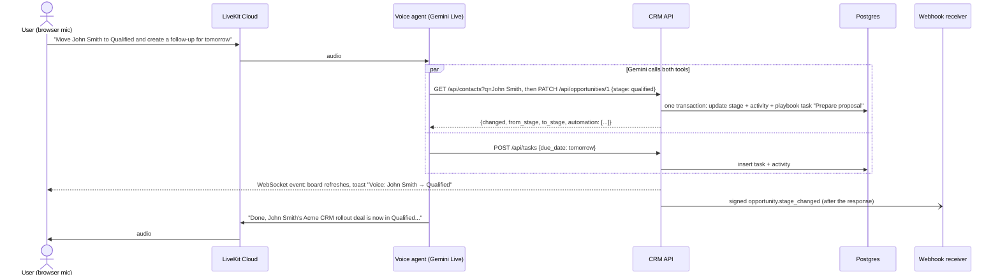

# VoiceCRM: a small CRM you can update by voice

A prototype CRM with contacts, deals and a sales pipeline. It runs automated workflows, sends and receives
webhooks, and has a voice assistant that makes changes in it. You click **Talk to assistant**, say
*"Move John Smith to Qualified and create a follow-up for tomorrow"*, and the card moves on the board while the
assistant replies. A follow-up task appears, the pipeline automation adds the next task, and a signed webhook goes
out to any automation tool.

| Requirement | Where it lives |
| --- | --- |
| Contacts or leads | `contacts` table, **Contacts** tab, **+ New lead** form, signed inbound lead webhook |
| Opportunities | `opportunities` table, with one card per deal on the board |
| A simple sales pipeline | Six stages: New → Contacted → Qualified → Proposal → Won / Lost. Change a stage from the board, by voice, or through the API |
| At least one automated workflow | Stage playbook and lead intake (see [Automated workflows](#automated-workflows)) |
| Voice AI that acts in the CRM | LiveKit agent on Gemini Live speech-to-speech, with four CRM tools that call the REST API |
| API and webhook integration | REST API, signed outbound webhooks (n8n, Zapier, Make, webhook.site), signed inbound webhook, LiveKit token endpoint |

## Architecture

```
Browser (React, :5174) ──REST + WebSocket──► FastAPI (:8001) ──asyncpg──► Postgres (Docker :5433)
  │ "Talk to assistant"                          ▲   │
  │ (LiveKit useSession)                         │   ├─ automations: playbook tasks, activity log
  ▼                                              │   ├─ signed outbound webhook ──► WEBHOOK_URL (n8n / Zapier / webhook.site)
LiveKit Cloud ◄──► Voice agent (Gemini Live) ────┘   └─ signed inbound lead webhook ◄── website form / Zapier / scripts/send_lead.py
                    tools = HTTP calls with X-API-Key
```

- **The API is the only place with business logic.** The voice agent has no database access. It is just another API
  client with its own key. A stage change runs the same validation and the same automations whether it comes from
  a voice command, a click in the browser, or a webhook.
- **Every change records who made it** (`ui`, `voice`, `webhook` or `automation`). The API takes this from the
  credential used, never from the request body, and writes it to `activities`, which is both the timeline and the
  audit log.
- **Live updates:** after each commit the API pushes a small event over a WebSocket, so every open tab sees voice
  changes straight away.

### What happens when you say the headline command



## Automated workflows

They run inside the same database transaction as the change that triggers them, whoever made it. The API response
lists what they did, so the assistant can tell the user ("the pipeline automation also added a Prepare proposal
task").

| Trigger | Automatic actions |
| --- | --- |
| Deal enters **Qualified** | Task "Prepare proposal" due in 2 days |
| Deal enters **Proposal** | Task "Chase decision" due in 3 days |
| Deal enters **Won** | Task "Onboarding kickoff" due tomorrow, and the contact becomes a **customer** |
| **New lead** (web form, voice, or inbound webhook) | Deal created in New, and task "Intro call" due tomorrow |
| Any stage change or new lead | Signed webhook `opportunity.stage_changed` / `lead.created` to `WEBHOOK_URL`. The delivery result is logged in the activity feed |

Playbook tasks are only created if the same task isn't already open. Webhooks are sent after the response, so a slow
receiver never delays the assistant's reply.

## The voice agent

- Built on LiveKit Agents (Python) from LiveKit's `agent-starter-python` template.
- Uses **Gemini Live** (`gemini-3.1-flash-live-preview`) as a single speech-to-speech model, so there is no separate
  speech-to-text or text-to-speech step.
- Tools in `src/agent.py`:
  - `move_deal_stage`
  - `create_follow_up`
  - `lookup_contact`
  - `create_lead`
- **Voice-specific handling:**
  - **Names heard slightly wrong still match.** The API ranks contacts with Postgres trigram similarity, so
    "Jon Smith" still finds John Smith.
  - **The agent never guesses between similar names.** `pick_contact` accepts an exact name, or a strong match that
    is clearly ahead of the next one. Otherwise it returns the candidates and the agent asks: *"Which John do you
    mean, John Park at Globex or John Smith at Acme Corp?"*
  - **A shared first name is not a match.** A full name has to be similar as a whole, so "James Wu" is never
    treated as James Lee. The agent asks *"Did you mean James Lee, or should I add James Wu as a new lead?"*
    Two contacts with the same name are told apart by company.
  - **A named deal is never swapped for another.** If the user names a deal that doesn't exist, the agent lists
    the contact's deals and asks.
  - **Relative dates are resolved against a calendar.** The prompt includes today's date and the next 14 days, so
    "tomorrow" or "next Friday" becomes a real date. The API also rejects dates in the past.
  - **Writes can't be cut off halfway.** Tools that change data call `disallow_interruptions()`, so speaking over the
    agent can't interrupt a write.
  - **Failures are reported, not hidden.** Errors come back as `ToolError`s with user-safe wording, so if the API is
    down the agent says nothing was saved. If a save times out, it says the change couldn't be confirmed and asks
    you to check the board, rather than inviting a retry that could create a duplicate.
  - **Clear commands run straight away.** The prompt tells the agent to do every requested action in one turn,
    confirm afterwards, and ask only when something is ambiguous. Three things get a quick yes first: moving a
    deal to Won, moving a deal to Lost, and adding a lead. Won makes the contact a customer, all three notify
    outside systems, and spoken names are easy to mishear.

## Security

- **Secrets stay in the gitignored `.env.local`.** The API refuses to start if its secrets are missing.
- **Browser login:** a shared password checked with `hmac.compare_digest`. It creates a signed, HttpOnly,
  SameSite=Lax session cookie, so cross-site requests can't carry it. After 10 wrong passwords within a minute,
  every login gets 429 until the minute passes, which makes brute-forcing impractical. The count is global, not per
  client address, because addresses can be spoofed with `X-Forwarded-For` and all look alike behind the dev proxy.
- **Voice agent:** has its own API key (`X-API-Key`) and can only use the CRM endpoints. There are no delete
  endpoints at all.
- **LiveKit tokens** are minted by the server, and only for a logged-in session.
  - The server picks the room, the identity and the agent to dispatch, and ignores anything the browser sends.
  - Tokens last 10 minutes and are valid for one fresh room.
  - The LiveKit secret never reaches the browser.
- **Inbound webhooks** are checked with HMAC-SHA256 over `timestamp.body`, using a constant-time comparison.
  Everything below happens before the body is parsed:
  - a missing or wrong signature, or a timestamp more than 5 minutes off, gets 401;
  - a resent copy of a request that was already processed gets 409 (replay protection). If processing failed, the
    sender's retry still goes through;
  - the body is read in chunks and cut off at 10 KB (413), so a huge upload never sits in memory.
- **Outbound webhooks** are signed the same way, so receivers can verify they came from this CRM.
- **The live-update WebSocket** requires the session cookie and refuses pages from other origins, which stops
  cross-site WebSocket hijacking. It only carries short summaries.
- **The agent treats CRM data as data.** Leads can arrive from outside forms, so the prompt tells the agent never
  to follow instructions found in names or deal titles (prompt-injection guard).
- **Input handling:** all SQL is parameterised (asyncpg), and request bodies are validated with Pydantic (types,
  lengths, allowed stages, IDs within the database's range, no NUL characters). Bad input gets a 422 or 404, never
  a 500. The database adds CHECK constraints.
- **Logs:** the webhook URL is kept out of the logs, and a webhook URL without a signing secret stops the API from
  starting.
- **Network exposure:** Postgres is published on `127.0.0.1` only, so the demo database isn't reachable from your
  network. CORS is limited to the web app's origin.

For production I would add:
- per-user accounts with roles;
- rate limiting across the whole API (today only login is throttled);
- a shared store such as Redis for the login throttle and replay cache, so they work across several API instances;
- HTTPS with `https_only` cookies;
- turning off the interactive API docs (`/docs`), which are open here for reviewers;
- secret rotation.

## Run it locally

You need: Docker, [uv](https://docs.astral.sh/uv/), Node 20+, a [LiveKit Cloud](https://cloud.livekit.io) project
and a [Gemini API key](https://aistudio.google.com/apikey).

```bash
# 0. Settings: copy .env.example to .env.local and fill it in
#    (lk app env --write --destination .env.local writes the LiveKit keys for you)
uv sync

# 1. Database (Postgres 17 on port 5433, with schema and demo data)
docker compose up -d

# 2. CRM API
uv run uvicorn crm_api.main:app --reload --port 8001      # API docs at http://localhost:8001/docs

# 3. Voice agent, connected to LiveKit Cloud      (new terminal)
uv run src/agent.py dev                                    # or: lk agent dev

# 4. Web app                                      (new terminal)
cd web && npm install && npm run dev                       # http://localhost:5174
```

Log in with the `ADMIN_PASSWORD` you set in `.env.local` and click **Talk to assistant**.

To reset the demo data: `docker compose down -v && docker compose up -d`.

### Demo script

1. Say *"Move John Smith to Qualified and create a follow-up for tomorrow."* Then watch:
   - the card moves and flashes;
   - two tasks appear, a voice follow-up and an automation "Prepare proposal";
   - the activity feed fills in.
2. Say *"Move John to Proposal."* The assistant asks which John you mean.
3. Say *"What's going on with Priya Patel?"* The assistant reads back the deal and her open task.
4. Set a card's stage to **Won** in the browser. The same automation runs: you get the onboarding task and the
   contact becomes a customer.
5. Send a lead from "outside" with `uv run python scripts/send_lead.py`. It appears live with an intro-call task.
   With `--bad-signature` the API returns 401.
6. Paste a [webhook.site](https://webhook.site) URL, or an n8n Webhook node URL, into `WEBHOOK_URL`, restart the
   API, and change a stage. The signed event arrives there, and "Webhook delivered (HTTP 200)" shows in the feed.

### Verifying a webhook signature (receiver side)

```python
expected = (
    "sha256="
    + hmac.new(
        WEBHOOK_SECRET.encode(), f"{ts}.".encode() + raw_body, hashlib.sha256
    ).hexdigest()
)
valid = (
    hmac.compare_digest(expected, request.headers["X-Signature"])
    and abs(time.time() - int(ts)) < 300
)
```

## Tests

```bash
uv run pytest                                                     # 22 tests, a few seconds
lk agent simulate text --scenarios scenarios.yaml --concurrency 2 # end to end; needs the DB and API running
```

Reset the demo data before running the simulations (`docker compose down -v && docker compose up -d`), since they
move John Smith's and John Park's deals.

- **`tests/test_agent.py`:** turn-level tests using LiveKit's testing framework, with every tool mocked.
  - The headline command must call `move_deal_stage(stage="qualified")` and `create_follow_up(due_date=<tomorrow>)`.
  - An ambiguous "John" must get a clarifying question.
  - When the CRM is down, the agent must say nothing was saved.
- **`tests/test_logic.py`:** unit tests for name matching, deal selection, webhook signatures (valid, tampered,
  wrong secret, stale), login throttling and webhook replay protection. They include the cases the review found:
  a shared first name must not match, namesakes are told apart by company, and a named deal that doesn't exist must
  not move another.
- **`scenarios.yaml`:** LiveKit Agent Simulations. A simulated user talks to the real agent, whose tools call the real
  API and database, and the transcripts are judged. The four scenarios cover:
  - the headline command;
  - the "which John?" case;
  - not inventing a contact;
  - never updating a different person who shares a first name ("James Wu" is not James Lee).

  Text simulations have no audio, so they run the same agent, prompt and tools on a text LLM.

## Project layout

```
src/agent.py            voice agent: prompt, tools, Gemini Live session, entrypoint
src/crm_client.py       agent-side API client, pick_contact / pick_deal, date helpers
src/crm_api/            FastAPI backend
  routes.py             endpoints (auth, board, contacts, deals, tasks, LiveKit token, inbound webhook)
  automations.py        playbook + lead intake + signed outbound webhooks
  security.py           session login, agent API key, HMAC sign/verify
  db.py, realtime.py, config.py, main.py
db/                     schema and demo data (loaded by docker compose on first start)
web/src/                React app: board, contacts, follow-ups, activity feed, voice panel (LiveKit components)
scripts/send_lead.py    signed test lead for the inbound webhook
tests/, scenarios.yaml  tests and simulations
```

## Design decisions and trade-offs

- **The agent uses the REST API, not the database.** There is one source of truth for validation, automations and
  the audit trail, and the agent's key limits what it can do. The cost is one extra HTTP hop (a few milliseconds on
  localhost).
- **Automations run in the request transaction, and webhooks run afterwards.** A stage change and its follow-up task
  always succeed or fail together, and the assistant can say what the automation did. Sending webhooks after the
  response keeps the voice reply fast. The trade-off is one delivery attempt: a production version would use an
  outbox table with retries.
- **Speech-to-speech instead of an STT → LLM → TTS chain.** Gemini Live gives natural, low-latency turns with a single
  model. The model is set on the `AgentSession` rather than the Agent, so tests and text simulations can run the
  same agent on a text LLM.
- **WebSocket rather than server-sent events for live updates.** uvicorn waits for open SSE streams on shutdown,
  which makes `--reload` hang.
- **The board loads in a single `GET /api/board`** with one refetch per live event. That's simple, and fast enough at
  prototype scale.
- **The shared password is only for the demo.** It keeps the focus on the workflow. Production would use an identity
  provider.

## What I'd do next

- Per-user accounts and roles. Log the salesperson's identity with every voice action.
- An outbox with retries for outbound webhooks, plus a scheduled job for overdue-task reminders.
- Phone access through LiveKit SIP, so reps can call in from the car.
- Deploy: `lk agent deploy` for the agent, the API and web app on Render or Fly, and managed Postgres.
- CI: run pytest, and run the simulations against a Postgres service container.
