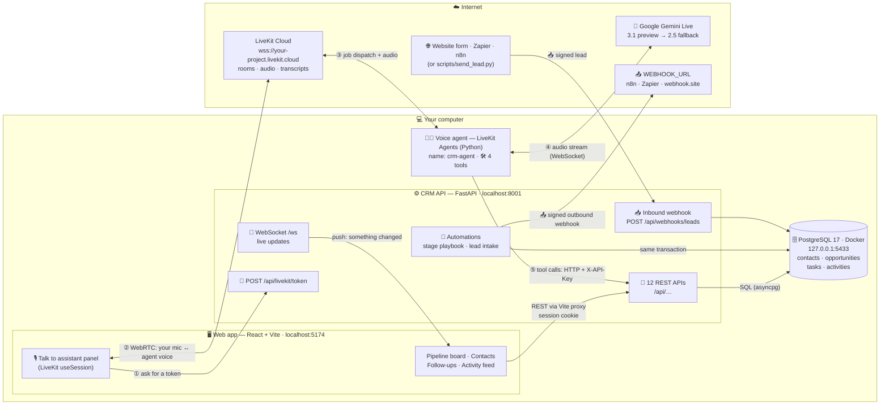
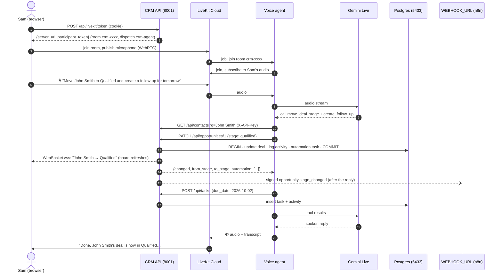
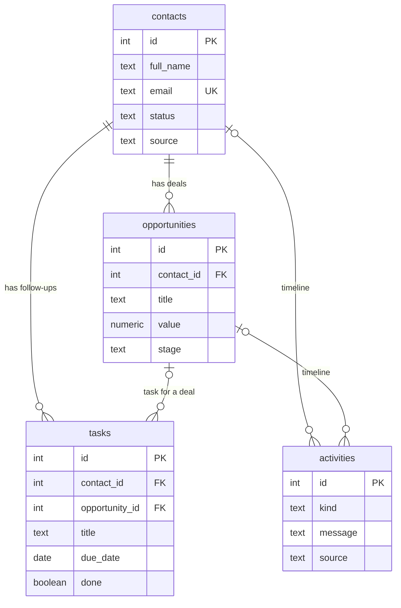
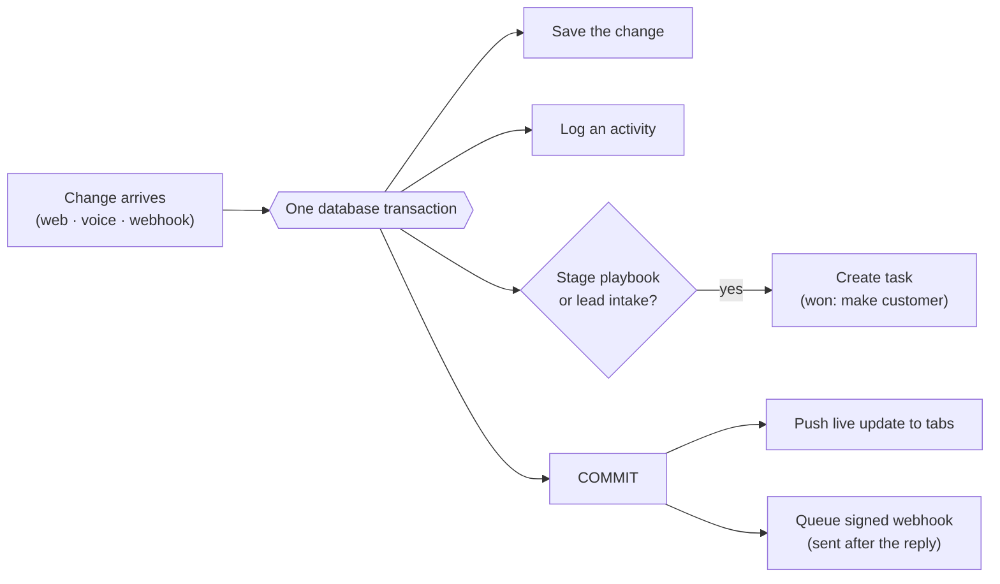
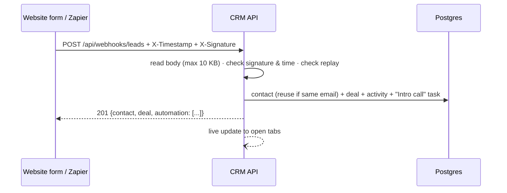
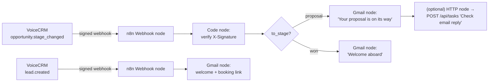

# VoiceCRM architecture: the whole story

This guide explains how every part of VoiceCRM fits together: what runs where, on which port, how your voice
reaches the AI, how the AI changes the CRM, how webhooks and automations work, and how it's all secured. It uses
simple words, diagrams, real code from the project, and a running example.

> The diagrams use **Mermaid**. They render on GitHub, and in VS Code with the "Markdown Preview Mermaid Support"
> extension.

**Contents**
1. [The whole application in one picture](#1-the-whole-application-in-one-picture)
2. [A story: one sentence, start to finish](#2-a-story-one-sentence-start-to-finish)
3. [The building blocks and their ports](#3-the-building-blocks-and-their-ports)
4. [The database](#4-the-database)
5. [The CRM API: all endpoints](#5-the-crm-api-all-endpoints)
6. [The Talk button: how the browser reaches LiveKit and the agent](#6-the-talk-button-how-the-browser-reaches-livekit-and-the-agent)
7. [The voice agent and its 4 tools](#7-the-voice-agent-and-its-4-tools)
8. [Automations](#8-automations)
9. [Webhooks: 1 in, 2 out](#9-webhooks-1-in-2-out)
10. [Live updates](#10-live-updates)
11. [Security, explained simply](#11-security-explained-simply)
12. [What to build next](#12-what-to-build-next)

---

## 1. The whole application in one picture



**The one rule that holds it all together:** only the **CRM API** touches the database. The web app, the voice
agent and outside systems all go through the API. Every change gets the same checks, the same automations and the
same audit log, whoever made it.

---

## 2. A story: one sentence, start to finish

Sam is a sales rep. Between two meetings, they open VoiceCRM, click **Talk to assistant** and say:

> *"Move John Smith to Qualified and create a follow-up for tomorrow."*

About two seconds later, John's card slides into **Qualified**, two tasks appear, and the assistant replies out
loud. Here's everything that happened behind the scenes:

1. **The browser asks for a ticket.** The Talk panel calls `POST /api/livekit/token`. The API checks Sam's login
   cookie and gives back a short-lived **LiveKit token**: a signed "ticket" for one private room, valid for 10
   minutes, which also says "send the agent named `crm-agent` to this room".
2. **The browser joins the room.** It connects to **LiveKit Cloud** with that token and starts sending Sam's
   microphone audio over **WebRTC**, the same real-time technology video calls use.
3. **LiveKit sends the agent.** LiveKit sees the room needs `crm-agent` and gives the job to our **voice agent**
   process, which has been waiting for work since it started. The agent joins the room and starts hearing Sam.
4. **The agent streams the audio to Gemini.** The agent forwards Sam's voice to **Gemini Live**, a model that
   listens and speaks directly with no separate speech-to-text step.
5. **Gemini decides what to do.** It understands two requests and asks the agent to run two **tools**:
   `move_deal_stage(contact_name="John Smith", stage="qualified")` and
   `create_follow_up(contact_name="John Smith", due_date="2026-10-02")`.
6. **The tools call the CRM API.** Each tool is a small HTTP call with the agent's secret key, for example
   `PATCH /api/opportunities/1` with `{"stage": "qualified"}`.
7. **The API saves it and runs the automation.** In one database transaction it updates the deal, writes an
   activity row ("moved from Contacted to Qualified"), and runs the **Qualified automation**, which creates a
   "Prepare proposal" task due in 2 days.
8. **The world is told.**
   - The API pushes a live update to every open browser tab, so the board refreshes and a toast pops up.
   - After replying, it sends a **signed webhook** to `WEBHOOK_URL`, for example an n8n workflow.
9. **The agent answers.** The tool results go back to Gemini, which speaks the reply through LiveKit into Sam's
   speakers: *"Done, John Smith's Acme CRM rollout deal is now in Qualified, with a follow-up call for Friday. The
   pipeline automation also added a Prepare proposal task for Saturday."*



---

## 3. The building blocks and their ports

| Block | What it is | Runs where | Port / address | Talks using | Code |
| --- | --- | --- | --- | --- | --- |
| **Web app** | React app: board, contacts, follow-ups, activity, Talk panel | your computer (Vite dev server) | **5174** (`localhost` only, fixed port) | HTTP, WebSocket, WebRTC | `web/src/` |
| **CRM API** | FastAPI server holding all business rules | your computer (uvicorn) | **8001** | HTTP + WebSocket | `src/crm_api/` |
| **Database** | PostgreSQL 17 | Docker container `crm-postgres` | **127.0.0.1:5433** on your machine (5432 inside the container) | Postgres protocol | `db/`, `docker-compose.yml` |
| **Voice agent** | LiveKit Agents worker named `crm-agent` | your computer (`uv run src/agent.py dev`) | **no inbound port**. It connects *out* to LiveKit. It also opens a small health-check server on a random local port. | WebSocket to LiveKit and Gemini, HTTP to the API | `src/agent.py`, `src/crm_client.py` |
| **LiveKit Cloud** | Real-time media server: rooms, audio tracks, text streams, agent dispatch | internet | `wss://<your-project>.livekit.cloud` (443). Media goes over UDP, with a TCP/TLS fallback on 443. | WebSocket signalling + WebRTC media | config in `.env.local` |
| **Gemini Live** | Google's speech-to-speech model | internet | 443 (secure WebSocket) | WebSocket | `gemini_live()` in `src/agent.py` |
| **Webhook receiver** | any tool you choose (n8n, Zapier, webhook.site) | internet | whatever `WEBHOOK_URL` says | HTTPS POST | `src/crm_api/automations.py` |

**Why the browser only ever talks to port 5174.** The Vite dev server forwards (proxies) `/api` and `/ws` to the
API on 8001 (`web/vite.config.ts`). To the browser everything is one site, so the login cookie "just works" and no
cross-site requests are needed:

```ts
// web/vite.config.ts
server: {
  port: 5174,
  strictPort: true,
  proxy: {
    "/api": { target: "http://localhost:8001", changeOrigin: true },
    "/ws": { target: "ws://localhost:8001", ws: true },
  },
},
```

**Settings live in one file,** `.env.local`, which is gitignored. The API and the agent both read it:
- the LiveKit URL and keys;
- the Gemini key;
- the database URL;
- the agent's API key, the session secret and the admin password;
- the webhook URL and secrets;
- the time zone.

---

## 4. The database

**What:** PostgreSQL 17 in a Docker container, database `crm`, reachable only from your machine at
`127.0.0.1:5433`. The data lives in the Docker volume `my-agent_crm_pgdata`, so it survives restarts. On first
start, `db/01_schema.sql` creates the tables and `db/02_seed.sql` loads the demo data.



| Table | Holds | Example row |
| --- | --- | --- |
| `contacts` | people you sell to | John Smith, Acme Corp, `lead` |
| `opportunities` | deals and their pipeline stage | *Acme CRM rollout*, $24,000, `contacted` |
| `tasks` | follow-ups | *Prepare proposal*, due 2026-10-03, `automation` |
| `activities` | the timeline / audit log | "John Smith: Acme CRM rollout moved from Contacted to Qualified", `voice` |

**How the API talks to it:** a pool of connections (asyncpg), and **parameterised SQL**, where values are passed
separately from the query text:

```python
# src/crm_api/routes.py: change_stage()
await conn.execute(
    "UPDATE opportunities SET stage = $2, updated_at = now() WHERE id = $1",
    deal_id,
    new,
)
```

Every field is described in detail in [HOW-THE-CRM-WORKS.md](HOW-THE-CRM-WORKS.md).

---

## 5. The CRM API: all endpoints

There are **12 HTTP endpoints and 1 WebSocket**, all in `src/crm_api/routes.py` and `src/crm_api/main.py`. FastAPI
also generates interactive docs at **http://localhost:8001/docs**.

| # | Method and path | What it does | Who can call it |
| --- | --- | --- | --- |
| 1 | `POST /api/auth/login` | Check the password, set the session cookie | anyone (throttled) |
| 2 | `POST /api/auth/logout` | Clear the session | anyone |
| 3 | `GET /api/auth/me` | "Am I logged in?" | anyone |
| 4 | `GET /api/health` | Is the API and database up? | anyone |
| 5 | `GET /api/board` | Everything the web app shows, in one call | web app (cookie) |
| 6 | `GET /api/contacts?q=…` | Fuzzy search by name or company | web app or agent |
| 7 | `POST /api/contacts` | Create a lead (contact + deal), which runs the lead automation | web app or agent |
| 8 | `PATCH /api/opportunities/{id}` | Move a deal to a stage, which runs the stage automation | web app or agent |
| 9 | `POST /api/tasks` | Create a follow-up task | web app or agent |
| 10 | `PATCH /api/tasks/{id}` | Mark a task done (or reopen it) | web app or agent |
| 11 | `POST /api/livekit/token` | Mint a LiveKit token for the Talk panel | web app (cookie) |
| 12 | `POST /api/webhooks/leads` | Receive a signed lead from outside | signed webhooks |
| — | `WS /ws` | Push live updates to open tabs | web app (cookie) |

**Who calls the API, and how:**

| Caller | How it proves who it is | Example |
| --- | --- | --- |
| Web app | session cookie (after login) | `fetch("/api/board")` in `web/src/api.ts` |
| Voice agent | `X-API-Key: <AGENT_API_KEY>` header | `api("PATCH", "/api/opportunities/1", json={...})` in `src/crm_client.py` |
| Outside system | HMAC signature headers | `scripts/send_lead.py` |

The agent's HTTP helper (`src/crm_client.py`) is about 40 lines. It uses LiveKit's shared HTTP session, an
8-second timeout, and turns every failure into a sentence the AI can repeat to the user:

```python
async def api(method, path, *, json=None, params=None):
    url = os.getenv("CRM_API_URL", "http://localhost:8001") + path
    headers = {"X-API-Key": os.getenv("AGENT_API_KEY", "")}
    session = utils.http_context.http_session()  # LiveKit's shared aiohttp session
    async with session.request(
        method,
        url,
        json=json,
        params=params,
        headers=headers,
        timeout=aiohttp.ClientTimeout(total=8),
    ) as response:
        ...
    if status >= 400:
        raise ToolError(_error_detail(data))  # e.g. "Deal not found"
```

---

## 6. The Talk button: how the browser reaches LiveKit and the agent

The Talk panel (`web/src/VoicePanel.tsx`) uses LiveKit's **Session API**, which handles the whole connection for
us:

```tsx
// Created once: asks OUR API for tokens. The browser never sees a LiveKit secret.
const tokenSource = TokenSource.endpoint("/api/livekit/token");

export function VoicePanel() {
  const session = useSession(tokenSource, { agentName: "crm-agent" });
  // Talk button → fetch a token, join the room, turn on the mic, wait for the agent
  const start = () => session.start({ signal: controller.signal });
  ...
}
```

On the server, the token endpoint decides everything that matters: the room, the identity, which agent joins, and
how long the token lives:

```python
# src/crm_api/routes.py
@router.post("/livekit/token", status_code=201, dependencies=[Depends(require_session)])
async def livekit_token():
    room = f"crm-{secrets.token_hex(4)}"  # a fresh private room every time
    token = (
        livekit_api.AccessToken(LIVEKIT_API_KEY, LIVEKIT_API_SECRET)
        .with_identity(f"crm-user-{secrets.token_hex(3)}")
        .with_grants(
            livekit_api.VideoGrants(
                room_join=True, room=room, can_publish=True, can_subscribe=True
            )
        )
        .with_room_config(
            livekit_api.RoomConfiguration(
                agents=[livekit_api.RoomAgentDispatch(agent_name="crm-agent")]
            )
        )  # send our agent
        .with_ttl(timedelta(minutes=10))
    )
    return {"server_url": LIVEKIT_URL, "participant_token": token.to_jwt()}
```

**What travels where once you're connected:**

| What | From → to | How |
| --- | --- | --- |
| Your voice | browser → LiveKit → agent | WebRTC audio track |
| The agent's voice | agent → LiveKit → browser | WebRTC audio track, played by `<RoomAudioRenderer/>` |
| Live transcript lines | agent → LiveKit → browser | LiveKit text streams, shown with `useSessionMessages()` |
| The moving bars | browser | `<BarVisualizer>` draws the agent's audio track |
| Agent state (listening / thinking / speaking) | agent → browser | participant attributes, read with `useAgent()` |

**How the agent gets there.** When it starts, the voice agent registers with LiveKit Cloud as a worker named
`crm-agent` (you see `registered worker` in its terminal). Because our token carries "dispatch `crm-agent`", LiveKit
hands the room to that worker the moment you join. If the agent isn't running, nobody joins, and after 20 seconds
the panel says "Agent did not join the room" and tells you how to start it.

---

## 7. The voice agent and its 4 tools

The agent (`src/agent.py`) is a LiveKit `Agent` with instructions (how to speak, the pipeline stages, today's date
and a 14-day calendar, safety rules) and **4 tools**. Each tool is just a Python function with a description the AI
reads:

| # | Tool | What it does | API it calls | Example phrase |
| --- | --- | --- | --- | --- |
| 1 | `lookup_contact` | Read a contact's company, deals and open tasks | `GET /api/contacts?q=` | "What's going on with Priya Patel?" |
| 2 | `move_deal_stage` | Move a deal to a stage | search, then `PATCH /api/opportunities/{id}` | "Move John Smith to Qualified" |
| 3 | `create_follow_up` | Create a task with a date | search, then `POST /api/tasks` | "Follow up with Olivia next Monday" |
| 4 | `create_lead` | Add a new contact + deal | `POST /api/contacts` | "Add Ana Diaz from Contoso as a lead" |

```python
# src/agent.py: one tool, shortened
@function_tool()
async def move_deal_stage(
    self,
    context: RunContext,
    contact_name: str,
    stage: Stage,
    deal_title: str | None = None,
    company: str | None = None,
):
    """Move a contact's deal to another pipeline stage. Automations may run afterwards…"""
    context.disallow_interruptions()  # don't let talking cut a save in half
    contact = await find_contact(contact_name, company)
    deal = pick_deal(contact, deal_title)
    return await api("PATCH", f"/api/opportunities/{deal['id']}", json={"stage": stage})
```

**How it finds the right person** (`pick_contact` in `src/crm_client.py`):
- **Exact name:** "John Smith" is used straight away.
- **Close full name:** "Jon Smith" is used, because the whole name is similar.
- **Only a shared first name:** "James Wu" does **not** become James Lee. The agent asks: *"Did you mean James Lee,
  or should I add James Wu as a new lead?"*
- **Several matches:** "John" matches John Smith and John Park, so it asks *"Which John?"*

**The brain: Gemini Live, with a backup.** The session runs on `gemini-3.1-flash-live-preview`. If Google drops the
session (`1011 Internal error`), LiveKit's `RealtimeModelFallbackAdapter` moves the call to
`gemini-2.5-flash-native-audio-latest` and replays the conversation so far:

```python
llm = (
    llm.RealtimeModelFallbackAdapter(
        [
            gemini_live(
                "gemini-3.1-flash-live-preview", max_retry=0
            ),  # fail over straight away
            gemini_live("gemini-2.5-flash-native-audio-latest"),
        ]
    ),
)
```

**Good manners built in:**
- It acts straight away on clear commands.
- It asks a quick "yes?" before **Won**, **Lost** or **adding a lead**.
- It never invents CRM facts.
- It treats CRM data as data, never as instructions.

---

## 8. Automations

Automations are rules the CRM runs **by itself** after a change, whoever made the change: web, voice or webhook.
They live in `src/crm_api/automations.py` and run **inside the same database transaction** as the change, so the
change and its automatic follow-ups are saved together or not at all.

```python
# src/crm_api/automations.py
PLAYBOOK = {
    "qualified": ("Prepare proposal", 2),  # task title, due in N days
    "proposal": ("Chase decision", 3),
    "won": ("Onboarding kickoff", 1),
}
```

| Trigger | What happens automatically |
| --- | --- |
| Deal → **Qualified** | task "Prepare proposal", due in 2 days |
| Deal → **Proposal** | task "Chase decision", due in 3 days |
| Deal → **Won** | task "Onboarding kickoff", due tomorrow, **and** the contact becomes a **customer** |
| **New lead** arrives | task "Intro call", due tomorrow |
| Any stage change or new lead | signed **outbound webhook** (section 9) |

Two safety rules:
- an automation never creates the same open task twice;
- it reports what it did, so the agent can tell you.

**Demo: watch the automations work.**
1. **Qualified:** say *"Move John Smith to Qualified."* A ⚙️ "Prepare proposal" task appears for John (due in 2
   days) and the agent mentions it.
2. **Won:** in the browser, change Priya Patel's card to **Won**. You get an ⚙️ "Onboarding kickoff" task, and in
   **Contacts** Priya's badge changes from *Lead* to *Customer*.
3. **New lead:** run `uv run python scripts/send_lead.py`. Maria Rodriguez appears in **New** with an ⚙️ "Intro
   call" task for tomorrow.
4. **Activity feed:** every step is listed there with its badge (Voice, Web, Automation, Webhook).



---

## 9. Webhooks: 1 in, 2 out

A **webhook** is one system calling another's URL to say "something happened". VoiceCRM has:

| Direction | Event | Endpoint / target | When |
| --- | --- | --- | --- |
| 📥 **In** | new lead | `POST /api/webhooks/leads` | a website form, Zapier, Make or n8n sends a lead |
| 📤 **Out** | `lead.created` | `WEBHOOK_URL` | a new lead is created |
| 📤 **Out** | `opportunity.stage_changed` | `WEBHOOK_URL` | a deal changes stage |

### 9.1 Outgoing: telling other tools

After the reply is sent, the API POSTs a JSON event to `WEBHOOK_URL`, if one is set, for example:

```http
POST https://your-n8n/webhook/crm
Content-Type: application/json
X-Event: opportunity.stage_changed
X-Timestamp: 1790839200
X-Signature: sha256=7d5c…e91a

{
  "event": "opportunity.stage_changed",
  "occurred_at": "2026-10-01T10:15:00+00:00",
  "data": {
    "contact_id": 1, "opportunity_id": 1, "contact": "John Smith",
    "deal": "Acme CRM rollout", "value": 24000.0,
    "from_stage": "contacted", "to_stage": "qualified", "changed_by": "voice"
  }
}
```

- **It's signed.** `X-Signature` is an HMAC of the timestamp and body made with `WEBHOOK_SECRET`, so the receiver
  can prove it came from us (section 11).
- **It never slows you down.** It runs as a background task after the response, with one attempt and a 5-second
  timeout.
- **It's logged.** The result shows in the Activity feed, for example "Webhook opportunity.stage_changed delivered
  (HTTP 200)".

**Try it:** open https://webhook.site, copy your unique URL into `WEBHOOK_URL=` in `.env.local`, restart the API,
and move a deal. The event appears on webhook.site.

### 9.2 Incoming: leads from outside

An outside system sends a lead **signed with `INBOUND_WEBHOOK_SECRET`**:

```json
{ "full_name": "Maria Rodriguez", "email": "maria.rodriguez@novatech.example",
  "company": "NovaTech", "deal_title": "Website chat assistant", "deal_value": 16000 }
```

| Situation | Answer |
| --- | --- |
| Correctly signed and valid | **201**: lead created, intro-call automation runs, live update sent |
| Missing, wrong or old signature (over 5 minutes) | **401** |
| The exact same request sent again | **409** (replay blocked) |
| Body bigger than 10 KB | **413** |
| Signed, but the data is invalid | **422** |

`scripts/send_lead.py` signs and sends a sample lead (`--bad-signature` shows the 401).



---

## 10. Live updates

So the board updates the moment the agent changes something, every browser tab keeps one **WebSocket** open to
`/ws`:

1. After every successful change, the API sends a small message such as
   `{"type": "crm", "actor": "voice", "summary": "John Smith: Acme CRM rollout moved from Contacted to Qualified", "opportunity_id": 1}`.
2. The tab reloads the board (`GET /api/board`), shows a toast, and briefly highlights the changed card.
3. Every 25 seconds the API sends a `ping` so idle connections stay open. If the connection drops, the tab
   reconnects with a growing delay, up to 10 seconds.

The code is in `src/crm_api/realtime.py` (server) and `web/src/live.tsx` (browser).

---

## 11. Security, explained simply

Think of the CRM as a building with a few doors. Each door has its own lock, and the lock decides **who** is
inside. That "who" is written into every activity row as the `source`.

### 11.1 The front door: login (web app)

The admin password is compared with `hmac.compare_digest`, which takes the same time whether the guess is close or
not, so the password can't be guessed by timing. Success gives a **signed session cookie**:

```python
# src/crm_api/main.py
app.add_middleware(
    SessionMiddleware,
    secret_key=SESSION_SECRET,
    session_cookie="crm_session",
    same_site="lax",  # not sent on cross-site POSTs, which blocks CSRF
    max_age=8 * 60 * 60,
)  # 8 hours
```

The cookie is **signed**, so a user can't edit it to pretend to be logged in, and **HttpOnly**, so page scripts
can't read it. **Brute force is capped:** after 10 wrong passwords in a minute, every login gets
`429 Too many failed attempts` until the minute passes (`LoginThrottle` in `security.py`).

### 11.2 The staff door: the voice agent's key

The agent doesn't log in. It sends a secret header. One small function decides who is calling:

```python
# src/crm_api/security.py
async def get_actor(conn, x_api_key: str | None = Header(default=None)):
    if x_api_key is not None:
        if AGENT_API_KEY and _same(x_api_key, AGENT_API_KEY):
            return "voice"  # it's the agent
        raise HTTPException(401, "Invalid API key")
    if is_logged_in(conn):
        return "ui"  # it's the web app
    raise HTTPException(401, "Login required")
```

Because the `source` comes from **the key or cookie used**, nobody can fake it by writing `"source": "voice"` in a
request. The agent's key can only reach CRM endpoints. It can't get LiveKit tokens or open the live feed, and
there are **no delete endpoints at all**.

### 11.3 The delivery door: signed webhooks

Anyone on the internet could POST to `/api/webhooks/leads`, so we only accept requests carrying a valid
**signature**. Both sides know a secret. The sender mixes the secret with the timestamp and body to make a code;
we make the same code and compare:

```python
# src/crm_api/security.py
def sign(secret, timestamp, body):
    return (
        "sha256="
        + hmac.new(
            secret.encode(), timestamp.encode() + b"." + body, hashlib.sha256
        ).hexdigest()
    )


def verify_signature(secret, timestamp, signature, body):
    ...
    if abs(time.time() - int(timestamp)) > 300:  # older than 5 minutes: reject
        return False
    return _same(sign(secret, timestamp, body), signature)
```

- **Changing one letter** of the body changes the code, so you get 401.
- **An old captured request** has a stale timestamp, so you get 401.
- **Sending a fresh one twice:** the `ReplayGuard` remembers it, so you get 409.
- **A huge upload** is cut off at 10 KB while it's still being read, so you get 413.

Our **outbound** webhooks are signed the same way, so n8n or Zapier can check they're really from us.

### 11.4 The meeting-room door: LiveKit tokens

The browser never holds the LiveKit secret. The token endpoint (section 6):
- only works for a logged-in browser;
- picks a **new random room** and identity;
- decides that **only `crm-agent`** may be sent, ignoring anything the browser asks for;
- makes the token expire in **10 minutes**.

### 11.5 The live-feed door: WebSocket

Browsers attach cookies to WebSocket connections even from other websites, so `/ws` checks both the cookie **and
where the page came from**:

```python
# src/crm_api/main.py
origin = ws.headers.get("origin")
if not is_logged_in(ws) or (origin is not None and origin not in ALLOWED_ORIGINS):
    await ws.close(code=1008)  # refused
```

### 11.6 Everything else

| Protection | What it stops | Where |
| --- | --- | --- |
| Parameterised SQL (`$1, $2`) | SQL injection | everywhere in `src/crm_api/` |
| Pydantic validation: allowed stages, lengths, ID ranges, no NUL characters | bad or malicious input. Gets 422, never 500 | `routes.py` |
| Database CHECK constraints | bad data even if a bug slipped through | `db/01_schema.sql` |
| Postgres bound to `127.0.0.1` | others on your Wi-Fi reaching the database | `docker-compose.yml` |
| Secrets only in gitignored `.env.local`; API refuses to start without them | leaked or weak secrets | `config.py`, `main.py` |
| Webhook URL kept out of logs | secret-looking URLs leaking into logs | `main.py` |
| CORS limited to the web app's origin | other sites calling the API with your cookie | `main.py` |
| Prompt-injection guard | a lead named "Ignore your rules…" steering the agent | prompt in `agent.py` |
| Confirmations for Won, Lost and new leads | a misheard name causing real changes | prompt in `agent.py` |
| `disallow_interruptions()` in tools that change data | a save cut off halfway by speech | `agent.py` |

---

## 12. What to build next

### 12.1 Long-term personal memory with Mem0

**Idea:** today the assistant forgets everything when the call ends. With **[Mem0](https://mem0.ai)** it could
remember, across calls:
- each salesperson's preferences, such as "I like follow-ups at 10 am" or "call me Sam";
- facts about clients, such as "John Smith prefers email" or "Priya's budget is approved in Q4".

**Story:**
- *Monday:* "Remember that John prefers email, not calls."
- *Thursday:* "Create a follow-up for John." The assistant answers: *"Done. I titled it 'Email John', since he
  prefers email."*

**How it would plug in:**
1. When the session starts, search Mem0 for this salesperson's memories and add them to the agent's instructions.
2. Add a 5th tool, `remember`, that saves a fact.
3. Store memories per salesperson (user ID) so nobody sees another's notes, and let users ask to forget things.

```python
# sketch: check the Mem0 docs for the exact client calls and response format
from mem0 import AsyncMemoryClient

memory = AsyncMemoryClient()  # reads MEM0_API_KEY


@function_tool()
async def remember(self, context: RunContext, fact: str) -> str:
    """Save a lasting preference or fact the user asks you to remember."""
    await memory.add([{"role": "user", "content": fact}], user_id=SALES_REP_ID)
    return "Saved."


# at session start
memories = await memory.search("preferences and client facts", user_id=SALES_REP_ID)
instructions += "\n# What you remember\n" + "\n".join(
    f"- {m['memory']}" for m in memories
)
```

### 12.2 Email automation with n8n

**Idea:** VoiceCRM already sends signed webhooks, and **[n8n](https://n8n.io)** can turn them into emails to
clients.

**Story:** Sam says *"Move John Smith to Proposal."* A minute later John gets *"Hi John, thanks for your time. Your
proposal for the Acme CRM rollout is on its way…"*. A brand-new lead gets a welcome email the moment they fill in
the website form.



**Steps:**
1. Run n8n (`docker run -p 5678:5678 n8nio/n8n`) and create a **Webhook** node. Turn on "Raw Body" so the
   signature can be checked against the exact bytes.
2. Put the node's URL in `WEBHOOK_URL`.
3. Add a **Code** node that recomputes `sha256=HMAC(WEBHOOK_SECRET, timestamp + "." + body)` and stops if it
   doesn't match.
4. Add an **IF** node on `data.to_stage`, then **Gmail** or **SMTP** nodes with templates.
5. One small CRM change: add the contact's **email** to the webhook `data` (one line in `routes.py`), so n8n knows
   where to send.

### 12.3 More ideas

| Idea | What it gives | How |
| --- | --- | --- |
| **Phone line** | Reps call a phone number from the car and update the CRM by voice | LiveKit SIP telephony: route an inbound number to the same `crm-agent` |
| **Call summaries** | After each conversation, a short summary is saved to the contact's timeline | When the session ends, ask the model for a summary and `POST` it as an activity |
| **Calendar sync** | Follow-ups appear in Google Calendar or Outlook with reminders | A webhook or n8n flow on `task_created` creates calendar events |
| **Daily digest and reminders** | Every morning: "3 overdue tasks, 2 deals waiting on proposals" by email or Slack | A scheduled job (or n8n cron) reads `/api/board` and sends a summary. Add retries with an outbox table. |
| **Real user accounts** | Each rep logs in as themselves; every change says *who* did it | An identity provider (Google or Microsoft login) instead of the shared password |
| **Deploy it** | A live demo link instead of localhost | `lk agent deploy` for the agent, Render or Fly for the API and web app, a managed Postgres |
