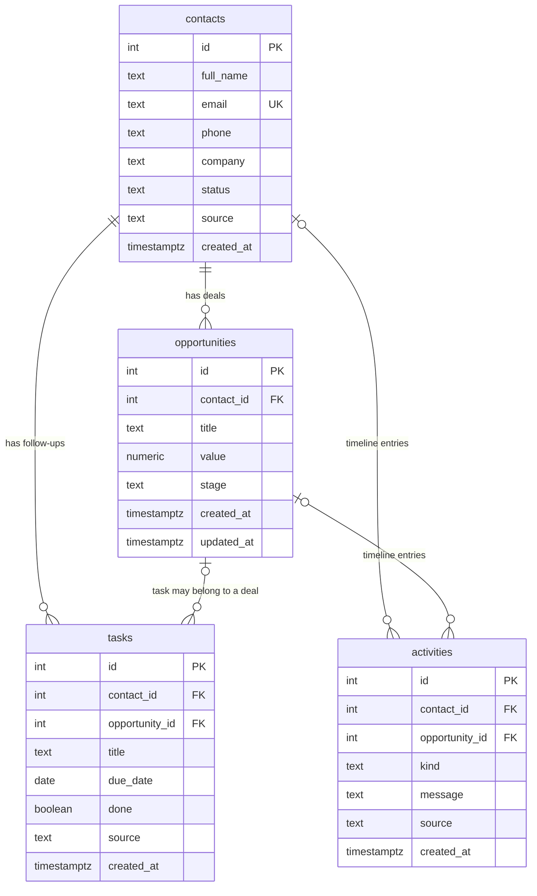

# How VoiceCRM works

A plain-language guide to what this CRM does, how its database is laid out, what every field means, and where
each piece of information is saved. All examples use the demo data that ships with the project (`db/02_seed.sql`).
The dates assume today is **Thursday 1 October 2026**.

---

## 1. The big picture

A **CRM** (Customer Relationship Management system) is where a sales team keeps track of three things:

1. **Who** they're talking to: the **contacts**, also called leads until they buy.
2. **What** they hope to sell them: the **deals**, also called opportunities, each worth some money.
3. **What to do next**: the **follow-up tasks**, such as "call John tomorrow".

Each deal moves through a **pipeline**, a fixed series of stages from first contact to signed or lost. The point of
a CRM is that nothing falls through the cracks: every deal has a stage, every next step has a date, and there's a
record of everything that happened.

VoiceCRM has four parts that share one database:

```
Web app (React, :5174) ──► CRM API (FastAPI, :8001) ──► Postgres database (Docker, :5433)
                                   ▲
Voice agent (LiveKit + Gemini) ────┘   (the agent changes data only through the API)
```

- **The database** stores everything (section 2).
- **The CRM API** holds all the rules. It validates every change, saves it, runs the automations, sends webhooks,
  and tells open browser tabs to refresh.
- **The web app** shows the pipeline board, the contacts, the follow-ups and the activity feed, and has the
  **Talk to assistant** button.
- **The voice agent** listens, understands, and calls the same API the web app uses. It never writes to the
  database directly.

---

## 2. Where the data lives

| What | Value |
| --- | --- |
| Database engine | PostgreSQL 17, running in Docker |
| Container name | `crm-postgres` |
| Database / user / password | `crm` / `crm` / `crm_password` (local demo values, set in `docker-compose.yml`) |
| Address | `127.0.0.1:5433`, on your machine only |
| Where the files are kept | the Docker volume `my-agent_crm_pgdata`, so data survives restarts |
| Table definitions | `db/01_schema.sql` |
| Demo data | `db/02_seed.sql` |

**How the database gets created:** the first time the container starts with an empty volume, Postgres runs the
scripts in `db/` in filename order. `01_schema.sql` creates the tables and `02_seed.sql` fills in 9 contacts,
9 deals, 5 tasks and 4 activity entries.

**Resetting:** `docker compose down -v && docker compose up -d` deletes the volume (`-v`), so the scripts run again
and you get fresh demo data.

**Looking at the data yourself:**

```cmd
docker exec -it crm-postgres psql -U crm -d crm
```

Then, for example:

```sql
SELECT * FROM contacts;
SELECT * FROM opportunities ORDER BY stage;
SELECT * FROM tasks WHERE NOT done ORDER BY due_date;
SELECT created_at, source, message FROM activities ORDER BY id DESC LIMIT 10;
\q
```

---

## 3. The four tables



In words:
- A **contact** can have many **deals** and many **tasks**.
- A task usually belongs to a deal too, but it doesn't have to.
- The **activities** table is the timeline: one row for every thing that happened, pointing at the contact and deal
  it was about.

### 3.1 `contacts`: the people you sell to

One row per person. A contact starts as a **lead** and becomes a **customer** when one of their deals is won.

| Field | Type | What it means | Example | How it gets its value |
| --- | --- | --- | --- | --- |
| `id` | number, automatic | The contact's unique number. Other tables point to it. | `1` | Postgres numbers new rows automatically. |
| `full_name` | text, 2–120 characters, required | The person's name. This is what the voice agent searches when you say a name. | `John Smith` | Typed in the **+ New lead** form, said to the voice agent, or sent by the inbound webhook. |
| `email` | text, optional, **unique** | Email address. No two contacts can share one, which is how a form submitted twice is spotted. | `john.smith@acme.example` | Same three ways as `full_name`. Always saved in lower case. |
| `phone` | text, optional | Phone number, saved exactly as given. | `+1 415 555 0101` | Same three ways. |
| `company` | text, optional | Where they work. The voice agent also matches on this, so "the Acme deal" finds John Smith. | `Acme Corp` | Same three ways. |
| `status` | `lead` or `customer` | Whether they have bought anything yet. | `lead` | New contacts start as `lead`. The **Won automation** changes it to `customer` and never changes it back. |
| `source` | `ui`, `voice`, `webhook` or `seed` | Who created the contact. | `seed` | Set by the API from **how the request was authenticated**, never from what the request says (section 4.2). |
| `created_at` | date and time with time zone | When the contact was added. | `2026-10-01 03:40:26+05` | Postgres fills it in automatically. |

**Shown in the app:** the **Contacts** tab lists every column above except `id` and `created_at`.

### 3.2 `opportunities`: the deals

One row per deal. Each deal belongs to exactly one contact and is always in exactly one pipeline stage.

| Field | Type | What it means | Example | How it gets its value |
| --- | --- | --- | --- | --- |
| `id` | number, automatic | The deal's unique number. | `1` | Automatic. |
| `contact_id` | number, required | Which contact the deal is with. Points to `contacts.id`. | `1` (John Smith) | Set when the lead is created. |
| `title` | text, 2–160 characters | A short name for the deal. | `Acme CRM rollout` | From the **Deal** box in the form or the webhook's `deal_title`. If none is given, the API makes one up as "*company* deal" or "*name* deal", for example `Contoso deal`. |
| `value` | money, 0 or more, 2 decimals | What the deal is worth, in US dollars. | `24000.00` | From **Value (USD)** in the form, `deal_value` from voice or webhook, or `0` if not given. |
| `stage` | one of `new`, `contacted`, `qualified`, `proposal`, `won`, `lost` | Where the deal is in the pipeline (section 4.1). | `contacted` | New deals start in `new`. It changes with the stage dropdown on the card, the voice agent's `move_deal_stage`, or the API. |
| `created_at` | date and time | When the deal was created. | — | Automatic. |
| `updated_at` | date and time | When the stage last changed. The board shows the most recently changed deals first in each column. | — | Set to "now" on every stage change. |

**Shown in the app:** each card on the **Pipeline** board is one row. The column is `stage`, and the card shows
`title`, the contact's name and company, `value`, a stage dropdown, and the next open task.

### 3.3 `tasks`: follow-ups

One row per to-do item. Open tasks appear in the **Follow-ups** list on the right; finished tasks stay in the
database but disappear from the list.

| Field | Type | What it means | Example | How it gets its value |
| --- | --- | --- | --- | --- |
| `id` | number, automatic | The task's unique number. | `6` | Automatic. |
| `contact_id` | number, required | Who the task is about. | `1` (John Smith) | From the voice agent or the automation that created it. |
| `opportunity_id` | number, optional | Which deal it's for, if any. | `1` (Acme CRM rollout) | Automations always set it. The voice agent sets it when the contact has one obvious deal, and otherwise leaves it empty. |
| `title` | text, 2–160 characters | What to do. | `Follow-up call`, `Prepare proposal` | Voice: whatever you asked for, with "Follow-up call" as the default. Automations use fixed titles (section 5.4). |
| `due_date` | date (no time) | The day it should be done. | `2026-10-02` | Voice: worked out from words like "tomorrow" or "next Monday". The API only accepts today up to one year ahead. |
| `done` | yes/no | Whether it's finished. | `false` | Starts `false`. Ticking the checkbox in Follow-ups sets it to `true`. |
| `source` | `ui`, `voice`, `automation`, `seed` | Who created the task. | `automation` | From the credential (section 4.2). The web app has no "new task" form today, so new tasks come from voice or automations. |
| `created_at` | date and time | When it was created. | — | Automatic. |

**Shown in the app:** the **Follow-ups** list shows open tasks ordered by `due_date`. It marks overdue ones in red and
today's in amber, and an icon shows the `source` (🎙️ voice, ⚙️ automation, 📦 demo data). The earliest open task of
each deal also appears on its card as "Next: …".

### 3.4 `activities`: the timeline and audit trail

One row for every event. Nothing in this table is ever edited; new rows are only added. That makes it a reliable
history of who did what and when.

| Field | Type | What it means | Example | How it gets its value |
| --- | --- | --- | --- | --- |
| `id` | number, automatic | Order of events. | `5` | Automatic. |
| `contact_id` | number, optional | Which contact the event was about. | `1` | Set by the API with the event. |
| `opportunity_id` | number, optional | Which deal it was about. | `1` | Set by the API with the event. |
| `kind` | text | What type of event it was (table below). | `stage_changed` | Set by the API. |
| `message` | text | A readable sentence describing it. This is exactly what the **Activity** feed shows. | `John Smith: Acme CRM rollout moved from Contacted to Qualified` | Written by the API. |
| `source` | `ui`, `voice`, `webhook`, `automation`, `seed` | Who caused it. | `voice` | From the credential (section 4.2). Automations always use `automation`. |
| `created_at` | date and time | When it happened. The feed shows it as "3 min ago". | — | Automatic. |

The values of `kind`:

| `kind` | Written when | Example `message` |
| --- | --- | --- |
| `lead_created` | A new lead is added (form, voice or webhook) | `New lead Ana Diaz (Contoso): Contoso deal` |
| `stage_changed` | A deal moves to another stage | `John Smith: Acme CRM rollout moved from Contacted to Qualified` |
| `task_created` | Someone or an automation creates a task | `Task 'Follow-up call' for John Smith due Friday 2 October` |
| `task_done` | A task is ticked off (or reopened) | `Task 'Send case studies' for Sarah Chen completed` |
| `status_changed` | The Won automation turns a lead into a customer | `Automation marked James Lee as a customer` |
| `webhook` | An outbound webhook was attempted | `Webhook opportunity.stage_changed delivered (HTTP 200)` |

**Shown in the app:** the **Activity** feed shows the latest 30 rows with a coloured badge for `source`.

### 3.5 Other database details

- **Rules the database enforces itself (CHECK constraints).** Stages, statuses and sources must be one of the
  allowed values. Names and titles must be 2 or more characters, and deal values can't be negative. Even a bug in
  the API couldn't save bad data.
- **Links between tables:**
  - Every deal and task must point at a real contact.
  - Deleting a contact would delete their deals, tasks and timeline. The API has no delete endpoint, so this never
    happens through the app.
  - If a deal were deleted, its tasks would remain, just no longer linked to a deal.
- **Indexes** make the common lookups fast: deals by contact, open tasks by due date, newest activities first.
- **The `pg_trgm` extension** gives "sounds-like" name matching, so a name heard slightly wrong still finds the
  right person (section 5.7).
- **Time zone.** Dates and times follow `Asia/Karachi`, set in `docker-compose.yml` and `.env.local`, so "today"
  and "tomorrow" mean the same thing to the database, the API and the voice agent.

---

## 4. Values worth knowing

### 4.1 The pipeline stages

| Stage | Meaning | Example from the demo data |
| --- | --- | --- |
| **New** | Just came in; nobody has talked to them yet. | Sarah Chen, *Fleet tracking pilot*, $12,500 |
| **Contacted** | First conversation has happened. | John Smith, *Acme CRM rollout*, $24,000 |
| **Qualified** | They have a real need, budget and timing. Worth a proposal. | Priya Patel, *Patient portal build*, $48,000 |
| **Proposal** | A price or proposal has been sent. Waiting for a decision. | Michael Brown, *Lead routing automation*, $8,000 |
| **Won** | Signed. They're a customer now. | Emma Wilson, *Member app*, $15,000 |
| **Lost** | Didn't happen. | David Garcia, *Voice ordering line*, $30,000 |

Everyday words the voice agent understands:
- "signed" or "closed won" means Won;
- "sent the proposal" means Proposal;
- "dead" or "closed lost" means Lost.

### 4.2 Sources: who did it

The `source` field on contacts, tasks and activities records who made the change. The API decides it from **how
the request proved who it is**, so it can't be faked by putting a different value in the request:

| Source | Meaning | How the API knows |
| --- | --- | --- |
| `ui` | Someone using the web app | The request carries a valid login cookie. |
| `voice` | The voice assistant | The request carries the agent's secret key in the `X-API-Key` header. |
| `webhook` | An outside system, such as a website form, Zapier or n8n | The request is signed with the inbound webhook secret. |
| `automation` | The CRM's own automated workflows | Written by the API's automation code. |
| `seed` | The demo data | Written by `02_seed.sql`. |

---

## 5. What the CRM can do, with examples

### 5.1 Add a lead

There are three ways to add a lead, and all three run the same code (`create_lead` in `src/crm_api/routes.py`):

| Way | Example | `source` saved |
| --- | --- | --- |
| **+ New lead** form | Name *Ana Diaz*, company *Contoso*, value *10000* | `ui` |
| Voice | *"Add a new lead: Ana Diaz from Contoso, worth about ten thousand dollars."* The agent asks you to confirm first. | `voice` |
| Inbound webhook | `uv run python scripts/send_lead.py` sends a signed lead for *Maria Rodriguez* | `webhook` |

What gets saved:
1. **`contacts`:** a new row with the name, company, email and phone, `status = lead`.
   - If the email already exists, the existing contact is reused and only blanks are filled in (missing phone or
     company), so a form submitted twice doesn't create a duplicate person.
2. **`opportunities`:** a new deal for that contact in stage `new`, with the title and value given.
3. **`activities`:** `lead_created`, for example "New lead Ana Diaz (Contoso): Contoso deal".
4. **Automation:** a `tasks` row "Intro call" due tomorrow (`source = automation`), plus its own `task_created`
   activity.

### 5.2 Move a deal through the pipeline

There are two ways, and both call `PATCH /api/opportunities/{id}`:
- **On the board:** pick a new stage in the dropdown on the card. It saves once you stop changing it.
- **By voice:** *"Move John Smith to Qualified."*

What gets saved:
1. **`opportunities`:** `stage` changes (for example `contacted` → `qualified`) and `updated_at` becomes now.
2. **`activities`:** `stage_changed`, for example "John Smith: Acme CRM rollout moved from Contacted to Qualified".
3. **Automations** for the new stage (section 5.4).

If the deal is already in that stage, nothing is saved and the agent says so.

### 5.3 Schedule and finish follow-ups

- **Create** by voice: *"Remind me to send pricing to Olivia Martinez next Monday."* This saves a **`tasks`** row
  with title "Send pricing", due date 2026-10-05 and `source = voice`, plus a `task_created` activity.
- **Finish** in the web app: tick the checkbox in **Follow-ups**. The task's `done` becomes `true`, it leaves the
  list, and a `task_done` activity is added.

### 5.4 Automated workflows

These run automatically, whoever made the change: web app, voice or webhook. They run in the **same database
transaction** as the change, so either everything is saved or nothing is. The code is in
`src/crm_api/automations.py`.

| When this happens | The CRM automatically… | Saved in |
| --- | --- | --- |
| A deal moves to **Qualified** | creates the task "Prepare proposal", due in 2 days | `tasks` + `activities` |
| A deal moves to **Proposal** | creates the task "Chase decision", due in 3 days | `tasks` + `activities` |
| A deal moves to **Won** | creates the task "Onboarding kickoff", due tomorrow | `tasks` + `activities` |
| A deal moves to **Won** | marks the contact as a **customer** | `contacts.status` + `activities` |
| A **new lead** arrives | creates the task "Intro call", due tomorrow | `tasks` + `activities` |
| Any stage change or new lead | sends a signed webhook to `WEBHOOK_URL`, if one is set | `activities` (delivery result) |

An automation never creates the same open task twice. If "Prepare proposal" is already open for that deal, it's
skipped.

### 5.5 The activity timeline

Every change above adds an `activities` row, so the **Activity** feed tells the full story:

```
Voice       John Smith: Acme CRM rollout moved from Contacted to Qualified
Automation  Automation created task 'Prepare proposal' due Saturday 3 October
Voice       Task 'Follow-up call' for John Smith due Friday 2 October
Automation  Webhook opportunity.stage_changed delivered (HTTP 200)
```

### 5.6 Webhooks: talking to other tools

- **Outgoing.** After a stage change or new lead, the CRM POSTs an event to `WEBHOOK_URL` (for example an n8n
  workflow or webhook.site), such as `opportunity.stage_changed` with the contact, deal, old and new stage, and who
  changed it.
  - It is signed with `WEBHOOK_SECRET`, so the receiver can check it really came from this CRM.
  - It is sent after the reply, so it never slows the voice agent down.
  - The result is saved as a `webhook` activity.
- **Incoming.** `POST /api/webhooks/leads` accepts new leads from outside.
  - The sender must sign the request with `INBOUND_WEBHOOK_SECRET`.
  - Unsigned, tampered, too old or repeated requests are refused.
  - A valid one is handled exactly like section 5.1, with `source = webhook`.

### 5.7 The voice assistant

The agent has four tools. Each one calls the CRM API with the agent's own key, so everything it does is checked,
saved and logged like any other change, with `source = voice`.

| Tool | You say | API it calls | Tables changed |
| --- | --- | --- | --- |
| `lookup_contact` | "What's going on with Priya Patel?" | `GET /api/contacts?q=Priya Patel` | none (read only) |
| `move_deal_stage` | "Move John Smith to Qualified" | search, then `PATCH /api/opportunities/1` | `opportunities`, `activities`, plus automations |
| `create_follow_up` | "Create a follow-up for tomorrow" | search, then `POST /api/tasks` | `tasks`, `activities` |
| `create_lead` | "Add Ana Diaz from Contoso as a lead" | `POST /api/contacts` | `contacts`, `opportunities`, `tasks`, `activities` |

How it finds the right person:
- **Exact name:** "John Smith" goes straight to John Smith.
- **Slightly misheard:** "Jon Smith" still finds John Smith, because the whole name is very similar.
- **Only a first name:** "John" matches both John Smith and John Park, so it asks *"Which John?"*
- **Only a shared first name:** "James Wu" is **not** James Lee. It asks whether you meant James Lee or want to add
  James Wu as a new lead.
- **Company:** "Acme" finds John Smith through his company.

It asks a quick yes before marking a deal Won or Lost, or adding a lead. Everything else happens straight away.

### 5.8 Live updates

After every saved change, the API sends a short message to every open browser tab over a WebSocket. The page then
reloads the board, shows a toast such as "🎙️ John Smith: Acme CRM rollout moved from Contacted to Qualified", and
briefly highlights the card. That's why a voice command shows up on screen while the agent is still talking.

### 5.9 Login

The web app needs the `ADMIN_PASSWORD` from `.env.local`. Logging in creates a signed session cookie that lasts
8 hours. After 10 wrong passwords in a minute, logins are paused for the rest of that minute.

---

## 6. Walk-through: one voice command, row by row

You say: **"Move John Smith to Qualified and create a follow-up for tomorrow."**

**Before** (fresh demo data):

| Table | Row |
| --- | --- |
| `contacts` | id 1, John Smith, Acme Corp, status `lead` |
| `opportunities` | id 1, contact 1, *Acme CRM rollout*, $24,000, stage **`contacted`** |
| `tasks` | no open tasks for John Smith |

**What happens:**
1. Gemini understands two actions and calls `move_deal_stage` and `create_follow_up`.
2. `move_deal_stage` searches for "John Smith", finds contact 1 and deal 1, and sends `PATCH /api/opportunities/1`
   with `{"stage": "qualified"}` and the agent's key.
3. In one transaction, the API:
   - updates the deal;
   - logs the stage change;
   - runs the Qualified automation, which creates "Prepare proposal" due Saturday;
   - commits;
   - pushes a live update;
   - queues the webhook.
4. `create_follow_up` turns "tomorrow" into 2026-10-02 and sends `POST /api/tasks`. The API saves the task and logs
   it.
5. The agent says: *"Done, John Smith's Acme CRM rollout deal is now in Qualified, with a follow-up call for
   Friday the second of October. The pipeline automation also added a Prepare proposal task for Saturday."*

**After:**

| Table | What changed |
| --- | --- |
| `opportunities` | deal 1: stage **`qualified`**, `updated_at` = now |
| `tasks` | new: *Follow-up call*, due 2026-10-02, contact 1, deal 1, `source = voice` |
| `tasks` | new: *Prepare proposal*, due 2026-10-03, contact 1, deal 1, `source = automation` |
| `activities` | new `stage_changed` (voice), two `task_created` (one voice, one automation), and a `webhook` entry if `WEBHOOK_URL` is set |
| `contacts` | unchanged. John stays a `lead`; only **Won** makes him a customer. |

---

## 7. What's calculated rather than saved

Some numbers on screen aren't stored anywhere. The API works them out each time the page loads (`board()` in
`src/crm_api/db.py`), so they can never be out of date:

| On screen | Worked out from |
| --- | --- |
| Number of deals and total $ at the top of each board column | the deals in that `stage` |
| "Next: Prepare proposal · Sat 3 Oct" on a card | the deal's earliest open task (`tasks` where `done = false`) |
| **Deals** and **Open pipeline** columns in Contacts | count of the contact's deals, and the sum of `value` for those not Won or Lost |
| Overdue (red) or today (amber) in Follow-ups | `due_date` compared with today's date in the CRM's time zone |
| The match score when the agent searches a name | trigram similarity between what you said and `full_name` / `company` |

---

## 8. Where each part of the screen comes from

| You see | Comes from |
| --- | --- |
| Pipeline columns | `opportunities.stage` |
| Card title, value | `opportunities.title`, `opportunities.value` |
| Name and company on a card | `contacts.full_name`, `contacts.company` (via `opportunities.contact_id`) |
| Stage dropdown on a card | changes `opportunities.stage` |
| Follow-ups list | `tasks` where `done = false` |
| Checkbox in Follow-ups | sets `tasks.done = true` |
| Icon next to a task | `tasks.source` |
| Activity feed text and badge | `activities.message` and `activities.source` |
| Contacts table | `contacts`, plus the calculated deal count and open pipeline |
| Status badge (Lead or Customer) | `contacts.status` |
| Toast and card highlight | the live-update message sent after each change (not stored) |
